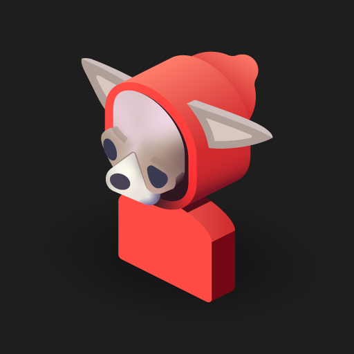

# Hoodik Client

<p align="center">
  
</p>

<p align="center">
  <a href="https://github.com/hudikhq/hoodik-client/actions/workflows/ci.yml"></a>
  <a href="https://play.google.com/store/apps/details?id=com.hudikhq.hoodik"></a>
  <a href="https://apps.apple.com/app/hoodik/id6761471179"></a>
  <a href="./LICENSE.md"></a>
</p>

End-to-end encrypted cloud storage client for iOS, Android and macOS. Built with
Flutter and Rust FFI, it connects to any self-hosted [Hoodik](https://github.com/hudikhq/hoodik)
server. Encryption and decryption happen on-device, so the server only ever
stores ciphertext.

🌐 **[hoodik.io](https://hoodik.io)** — Website &nbsp;|&nbsp; ☁️ **[Hoodik Cloud](https://hoodik.cloud)** &nbsp;|&nbsp; 🖥️ **[Server](https://github.com/hudikhq/hoodik)** &nbsp;|&nbsp; ⚡ **[Self-Hosting Guide](https://hoodik.io/get-started)**

| Platform | Distribution |
|----------|--------------|
| Android | [Google Play](https://play.google.com/store/apps/details?id=com.hudikhq.hoodik) |
| iOS | [App Store](https://apps.apple.com/app/hoodik/id6761471179) |
| macOS | [Mac App Store](https://apps.apple.com/app/hoodik/id6761471179) |

Those listings are the only places we publish builds; anything downloadable
elsewhere was built by someone else and may have been modified. If you want
certainty instead of trust, build from source below.

Windows and Linux are not shipped yet. The Flutter scaffolding for both is in
the tree and the app builds, but the markdown editor renders in a WebView and
`webview_flutter` has no Windows or Linux implementation, so notes are broken
on those platforms. Until that is solved, use the web frontend that ships with
the server.

## Quick Start

### Prerequisites

- **Flutter** >= 3.41 (stable), which provides Dart 3.11+
- **Rust** >= 1.91, via [rustup](https://rustup.rs/)
- **Xcode** for iOS and macOS builds
- **Android NDK** + JDK 17 for Android builds, with `ANDROID_NDK_HOME` set
- The **main hoodik repo** cloned alongside this one, because the Rust crates are
  consumed through local path patches:

  ```
  parent/
  ├── hoodik/         # git clone https://github.com/hudikhq/hoodik.git
  └── hoodik-client/  # this repo
  ```

### Run

```shell
flutter pub get
flutter run
```

The first Rust compile takes 5-10 minutes because of transitive dependencies.
After that builds are incremental.

### Build for release

```shell
flutter build appbundle --release   # Android App Bundle (Play Store)
flutter build apk --release         # Android APK
flutter build ipa --release         # iOS, requires Xcode signing
flutter build macos --release       # macOS
```

[Development Guide](docs/development.md) covers platform-specific setup;
[Release Guide](docs/release-guide.md) covers signing and store submission.

## Architecture

```
Flutter UI (Riverpod + GoRouter)
        |
   Core Services
   (FileOperations, TransferManager, AuthService, CryptoService, OfflineManager)
        |
   +-----------+------------------+
   |           |                  |
Worker      Rust FFI           Drift
Isolates    (flutter_rust_bridge) SQLite
(upload,    +----------------+
 download,  | cryptfns crate |
 decrypt)   | transfer crate |
            +----------------+
```

| Technology | Purpose |
|------------|---------|
| Flutter 3.41+ / Dart 3.11+ | UI framework |
| Riverpod | State management |
| GoRouter | Routing and navigation |
| flutter_rust_bridge v2.11.1 | Rust FFI bindings |
| Drift | Local SQLite database |
| Dio | HTTP client, one cookie jar per account |

### Shared Rust crates

The app calls the same crates the web frontend compiles to WASM, so a crypto or
transfer fix lands in every client at once:

- **`cryptfns`** -- Ed25519, hybrid X25519 + ML-KEM-768 wrapping, RSA-2048 (legacy),
  AEGIS-128L/AEGIS-256, Ascon-128a, ChaCha20-Poly1305, OPAQUE, BERT tokenizer, hashing
- **`transfer`** -- chunked upload/download with concurrent I/O, encryption, checksums

Path patches in `rust/.cargo/config.toml` point at `../../hoodik/cryptfns` and
`../../hoodik/transfer`.

## Features

- Multi-server and multi-account
- OPAQUE login, so the password itself never crosses the wire, plus signature login and 2FA
- PIN quick unlock and biometric unlock (Face ID / Touch ID)
- Chunked encrypted upload with CRC-16 integrity, concurrent encrypted download
- Three background isolates (upload, download, decrypt) keep crypto off the main thread
- File preview for images with gallery swipe, video, PDF and text
- Encrypted thumbnails, generated and decrypted on-device
- Markdown notes with an editor and version history
- Account-to-account sharing and share groups
- Public link management
- Search that tokenizes on-device with BERT and sends only SHA-256 hashes
- Offline caching with LRU eviction and pin/unpin, plus a pending upload queue
- Embedded MCP server on desktop, giving local AI agents access to your storage
  without the server ever seeing plaintext (see [MCP.md](MCP.md))
- Admin panel for users, invitations and server settings
- Localized in English, French, German and Croatian
- Material 3 on Android, Cupertino on iOS, dark and light themes

## Testing

```shell
flutter test        # host-VM suite
flutter analyze     # static analysis
dart format .       # formatting
just release-check  # the full gate used before tagging a release
```

See the [Testing Guide](docs/testing.md).

## CI/CD

| Workflow | Trigger | What it does |
|----------|---------|-------------|
| [CI](.github/workflows/ci.yml) | Push/PR to `main` | format, analyze, invariants, unit tests, iOS build verify |
| [Release Android](.github/workflows/release-android.yml) | Tag `v*` | build and upload the App Bundle to Play |
| [Release Apple](.github/workflows/release-apple.yml) | Tag `v*` | build and upload iOS and macOS to App Store Connect |
| [Version verify](.github/workflows/version-verify.yml) | Push/PR | pubspec version and build number must move together |

See the [CI/CD Guide](docs/ci-cd.md).

## Documentation

| Document | Description |
|----------|-------------|
| [Architecture](docs/architecture.md) | Tech stack, state management, directory structure |
| [Security](docs/security.md) | Encryption model, crypto primitives, private key handling |
| [Development](docs/development.md) | Dev setup, building, linting, env config |
| [Testing](docs/testing.md) | Test layout and conventions |
| [Release Guide](docs/release-guide.md) | Signing, certificates, store submission |
| [CI/CD](docs/ci-cd.md) | Workflows, Fastlane, required secrets |
| [Compat Testing](docs/compat-testing.md) | Backwards-compat gate against older servers |
| [MCP](MCP.md) | The embedded MCP server for AI assistants |

## Security

All encryption and decryption is client-side. The server never receives
plaintext file content, file names, thumbnails, search terms, or keys. If a
change appears to need server-side plaintext, it is the change that is wrong.

Report vulnerabilities to [security@hudik.eu](mailto:security@hudik.eu) rather
than opening a public issue. See [SECURITY.md](./SECURITY.md) for what is in
scope and the disclosure guidelines, and [docs/security.md](docs/security.md)
for the full model.

## Contributing

Patches are welcome. Read [docs/development.md](docs/development.md) to get set
up, and keep `flutter analyze`, `dart format` and `flutter test` clean before
opening a pull request.

First-time contributors are asked to sign the [Contributor License Agreement](./CLA.md).
A bot comments on your pull request with the sentence to reply with. You sign
once and it covers everything you send afterwards. You keep the copyright in
your own work.

## License

[CC BY-NC 4.0](./LICENSE.md) — free for personal and non-commercial use. For
commercial licensing, contact [hello@hudik.eu](mailto:hello@hudik.eu).

Third-party software included in the app is listed in
[THIRD-PARTY.md](./THIRD-PARTY.md), and the full license text of every
dependency is available in the app under **Account → Open source licenses**.

## Authors

Created and maintained by [Tibor Hudik](https://github.com/htunlogic).

Community patches are welcome and appreciated. Everyone who has sent one is listed in the [contributors graph](https://github.com/hudikhq/hoodik-client/graphs/contributors).
